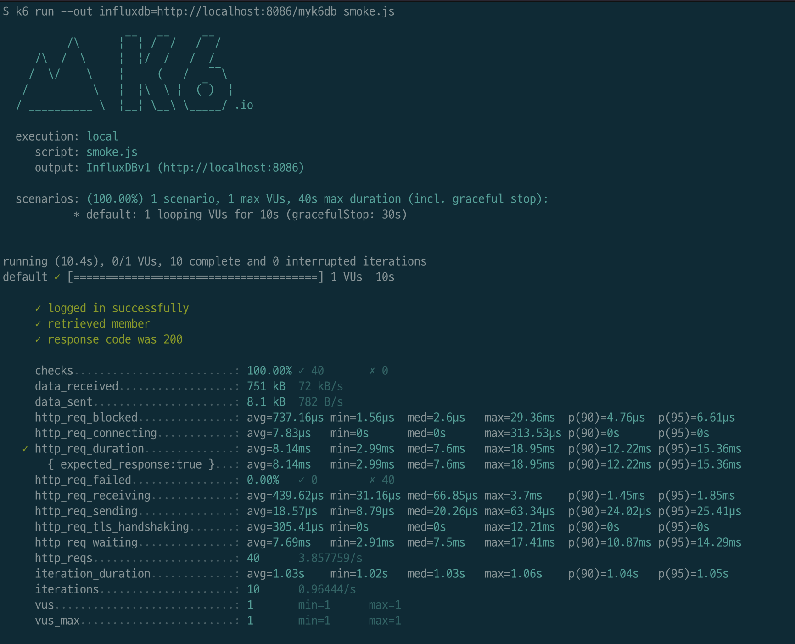
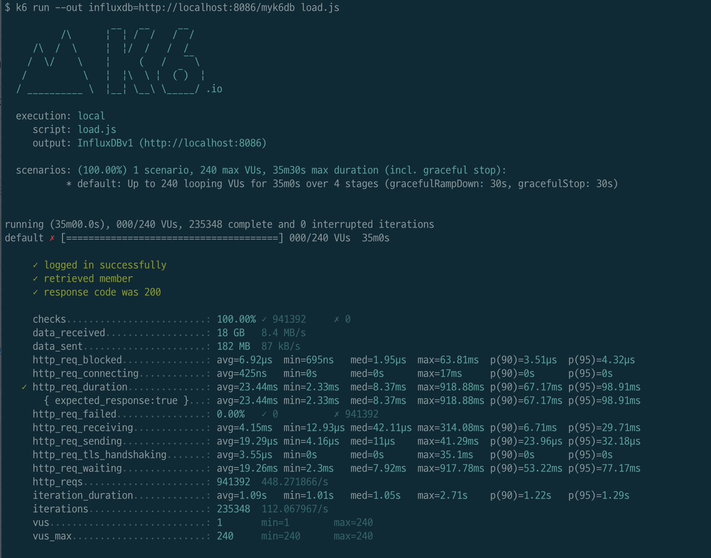

<p align="center">
    
</p>
<p align="center">
  
  
  <a href="https://edu.nextstep.camp/c/R89PYi5H" alt="nextstep atdd">
    
  </a>
  
</p>

<br>

# 인프라공방 샘플 서비스 - 지하철 노선도

<br>

## 🚀 Getting Started

### Install
#### npm 설치
```
cd frontend
npm install
```
> `frontend` 디렉토리에서 수행해야 합니다.

### Usage
#### webpack server 구동
```
npm run dev
```
#### application 구동
```
./gradlew clean build
```
<br>


### 1단계 - 웹 성능 테스트
1. 웹 성능예산은 어느정도가 적당하다고 생각하시나요

### 경쟁사 분석
#### 휴대전화 성능 지표
|서비스|성능|FCP(초)|LCP(초)|TTI(초)|TBT(밀리초)|SI(초)| CLS |
|---|---|---|---|---|---|---|---|
|서울교통공사|25|6.4|6.6|9.2|1810|8.7| 0|
|네이버지도|60|2.2|8|6|250|5.8|0.03|
|카카오맵|70|1.7|5|4.1|40|6.7|0.139|

#### 데스크탑 성능 지표
|서비스|성능|FCP(초)|LCP(초)|TTI(초)| TBT(밀리초) |SI(초)|CLS|
|---|---|---|---|---|---|---|---|
|서울교통공사|70|1.5|3.7|2|70|2.3|0|
|네이버지도|90|0.5|1.6|0.5|0|2.2|0.006|
|카카오맵|92|0.5|1.3|0.7|0|2.2|0.003|

#### 경쟁사를 분석 해보았을때 런닝맵의 웹 성능예산을 아래와 같이 정리하였습니다.
| 지표    | 모바일      | 데스크탑     |
|-------|----------|----------|
| FCP   | 3s       | 0.5s     |
| LCP   | 6s       | 1s       |
| TTI   | 5s       | 0.5s     |
| TBT   | 500ms    | 10ms     |
| JS,CSS | 300KB 미만 | 300KB 미만 |
| 글꼴    | 500KB 미만 | 500KB 미만 |
| Image | 1MB 미만   | 1MB 미만   |
| 성능점수  | 60점 이상   | 80점 이상   |

2. 웹 성능예산을 바탕으로 현재 지하철 노선도 서비스는 어떤 부분을 개선하면 좋을까요
* JS/CSS/글꼴/이미지등의 정적 리소스는 최적화 및 축소하여 네트워크 전송 용량을 줄입니다.
* JS/CSS는 병합하여 브라우저의 호출 횟수를 줄입니다.
* CDN과 캐시를 사용하여 빠르게 컨텐츠를 제공할 수 있도록 합니다.
* 프록시 서버에서도 웹 컨텐츠를 캐싱합니다.
* 데이터베이스 조회 결과를 Redis등으로 캐싱하여 디비 I/O를 줄입니다.

---

### 2단계 - 부하 테스트 
1. 부하테스트 전제조건은 어느정도로 설정하셨나요

#### 목표 RPS 구하기
* 예상 1일 사용자 수(DAU): **470만(4,700,000)**
  * [관련기사](https://www.donga.com/news/Society/article/all/20220511/113346548/1)
* 피크 시간대의 집중률:
  * 최대 트래픽: **110만(1,100,000)**
  * 평소 트래픽: **40만(400,000)**
  * [관련기사](https://www.bigdata-map.kr/datastory/traffic/seoul)
* 1명당 1일 평균 접속 혹은 요청 수: **3번**(출근, 퇴근, 환승)
* 1번 접속시 요청: 로그인 정보 조회(1회) + 경로 검색 페이지(1회) + 경로 검색 결과(1회)
* **Throughput 계산**
  * **1일 총 접속 수:** 4,700,000 x 3 = **14,100,000**
  * **1일 평균 RPS:** 14,100,000 / 86,400 = **163.19rps**
  * **1일 최대 RPS:** 163.19rps x (1,100,000 / 400,000) = **448.78rps**

* VUser 구하기
* Latency = 200ms, R = 3, Delay time = 1로 가정
* T = (3 * 0.2) + 1 = **1.6**
* VU(최대) = (163.19 * 1.6) / 3 = 87명
* VU(최대) = (448.78 * 1.6) / 3 = 239명

2. Smoke, Load, Stress 테스트 스크립트와 결과를 공유해주세요
* 테스트 경로는 3가지 테스트 모두 가장 접속을 많이 할 것이라고 예상되는 `/path` 경로로 테스트하였습니다.
  #### smoke.js
  ```shell
  import http from 'k6/http';
  import { check, group, sleep, fail } from 'k6';
  
  export let options = {
    vus: 1, // 1 user looping for 1 minute
    duration: '10s',
  
    thresholds: {
      http_req_duration: ['p(99)<1500'], // 99% of requests must complete below 1.5s
    },
  };
  
  const BASE_URL = 'https://devdog.p-e.kr/path';
  const USERNAME = 'jeongjae.eom@gmail.com';
  const PASSWORD = '1234';
  
  export default function ()  {
  
    var payload = JSON.stringify({
      email: USERNAME,
      password: PASSWORD,
    });
  
    var params = {
      headers: {
        'Content-Type': 'application/json',
      },
    };
  
  
    let loginRes = http.post(`${BASE_URL}/login/token`, payload, params);
  
    check(loginRes, {
      'logged in successfully': (resp) => resp.json('accessToken') !== '',
    });
  
  
    let authHeaders = {
      headers: {
        Authorization: `Bearer ${loginRes.json('accessToken')}`,
      },
    };
    let myObjects = http.get(`${BASE_URL}/members/me`, authHeaders).json();
    check(myObjects, { 'retrieved member': (obj) => obj.id != 0 });
    sleep(1);
  };
  ```
  #### Smoke 테스트 결과
  

  #### load.js
  ```shell
  import http from 'k6/http';
  import { check, group, sleep, fail } from 'k6';
  
  export let options = {
  stages: [
  { duration: '5m', target: 87 },
  { duration: '30m', target: 87 },
  { duration: '5m', target: 0 },
  ],
  thresholds: {
  http_req_duration: ['p(99)<1500'], // 99% of requests must complete below 1.5s
  },
  };
  
  const BASE_URL = 'https://devdog.p-e.kr/path';
  const USERNAME = 'jeongjae.eom@gmail.com';
  const PASSWORD = '1234';
  
  export default function ()  {
  
  var payload = JSON.stringify({
  email: USERNAME,
  password: PASSWORD,
  });
  
  var params = {
  headers: {
  'Content-Type': 'application/json',
  },
  };
  
  
  let loginRes = http.post(`${BASE_URL}/login/token`, payload, params);
  
  check(loginRes, {
  'logged in successfully': (resp) => resp.json('accessToken') !== '',
  });
  
  
  let authHeaders = {
  headers: {
  Authorization: `Bearer ${loginRes.json('accessToken')}`,
  },
  };
  let myObjects = http.get(`${BASE_URL}/members/me`, authHeaders).json();
  check(myObjects, { 'retrieved member': (obj) => obj.id != 0 });
  sleep(1);
  };
  ```
  #### Load 테스트 결과
  

  #### stress.js
  ```shell
  import http from 'k6/http';
  import { check, group, sleep, fail } from 'k6';
  
  export let options = {
  stages: [
  { duration: '1m', target: 10 },
  { duration: '1m', target: 50 },
  { duration: '1m', target: 100 },
  { duration: '1m', target: 200 },
  { duration: '5m', target: 300 },
  { duration: '5m', target: 0 },
  ],
  thresholds: {
  http_req_duration: ['p(99)<1500'], // 99% of requests must complete below 1.5s
  },
  };
  
  const BASE_URL = 'https://devdog.p-e.kr/path';
  const USERNAME = 'jeongjae.eom@gmail.com';
  const PASSWORD = '1234';
  
  export default function ()  {
  
  var payload = JSON.stringify({
  email: USERNAME,
  password: PASSWORD,
  });
  
  var params = {
  headers: {
  'Content-Type': 'application/json',
  },
  };
  
  
  let loginRes = http.post(`${BASE_URL}/login/token`, payload, params);
  
  check(loginRes, {
  'logged in successfully': (resp) => resp.json('accessToken') !== '',
  });
  
  
  let authHeaders = {
  headers: {
  Authorization: `Bearer ${loginRes.json('accessToken')}`,
  },
  };
  let myObjects = http.get(`${BASE_URL}/members/me`, authHeaders).json();
  check(myObjects, { 'retrieved member': (obj) => obj.id != 0 });
  sleep(1);
  };
  ```
  #### Stress 테스트 결과
  
  

---

### 3단계 - 로깅, 모니터링
1. 각 서버내 로깅 경로를 알려주세요

2. Cloudwatch 대시보드 URL을 알려주세요
